+++
date = '2025-09-15T00:46:47+08:00'
draft = false
title = 'Project Homelab - Part 1: Laying the Foundation'
+++

# Fooling Around with a Future-Proof Home Network

Around early 2022, I finally received the keys to my [BTO](https://en.wikipedia.org/wiki/Build_to_order_(HDB)) flat in Singapore. The whole construction project was delayed by a year due to COVID-19, resulting in a total wait time of 5 years. As our family was still residing in Switzerland back then, we flew back to Singapore for 6 weeks just to deal with planning the renovations.

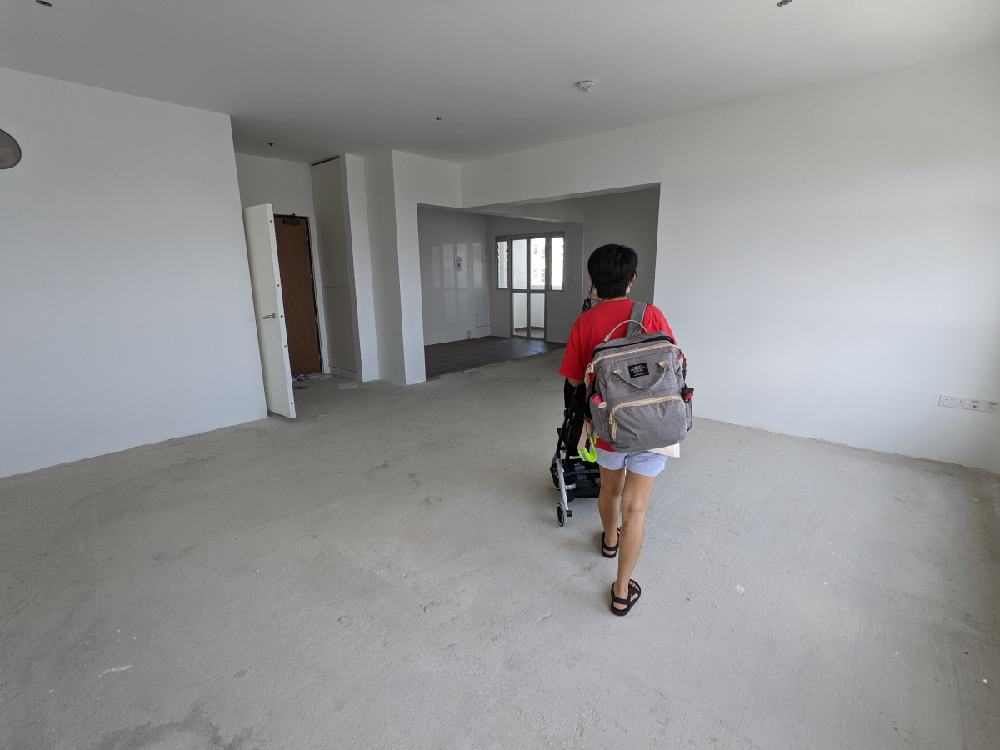

As shown in the photo, there was absolutely nothing. We had opted out of all of the government-offered packages in order to design our new home from scratch. This gave me the very rare opportunity of planning my home network infrastructure exactly the way I wanted it.

Modern HDB flats built after 2014 come with built-in Cat 6 Ethernet wiring. It connects the entrance shoe cabinet, housing the [DB box](https://en.wikipedia.org/wiki/Distribution_board), to every single room in the house. These cables are buried inside the concrete and rebars and very much capped at 10Gbps in the best case scenario. In most of my real world usage, I have only been able to get it to function at 1Gbps, since I can't control the crosstalk interference and unknown cable lengths that HDB has provided.

To be fair, normal home network usage doesn't need anything beyond 1Gbps. But the rationale for wanting a homelab has never really been about practicality anyway. This is one of those things where "because I can" precedes the "why".

---

**And I wanted something that is truly future proof.**

---

# Crash Course on Fibre

Since I had been following the [fibre blog posts](https://michael.stapelberg.ch/posts/tags/fiber/) from Michael Stapelberg, I came to the conclusion that a truly future proofed home network had to be based on optic fibre. The biggest obstacle I faced was my inherent lack of knowledge of networking at this point. Supplementing my lacking networking knowledge was partially the reason I wanted to get serious about building up a home lab. I understood the bandwidth limits of Ethernet cable categories, what Wi-Fi mesh is, DNS lookups, difference between a router and switch, and used VLANs on my ASUS router to segregate IoT devices. I could calculate CIDR ranges in my head and knew the very basics of `iptable` in Linux to setup rudimentary firewalls.

And... that's about it.

This was 2022 when LLM AI tools didn't readily exist and Google Bard wasn't even a thing. Everything had to be learnt from pure Google-Fu and bothering random people for advice. I sent Michael a series of messages asking for guidance on what I needed to know before installing random fibre cables inside my house. Being the awesome person that he is, he replied me on internal Google Chat with lots of detailed explanations. His recommendations could be summarised into:

* The connectors don't really matter because there are adapters. However, I can't really go wrong with Duplex LC/UPC connectors.
* Go with [Simple Mode Fibre](https://en.wikipedia.org/wiki/Single-mode_optical_fiber) (SMF, specifically [OS2](https://www.fs.com/uk/blog/comparison-between-os1-and-os2-smf-cables-2696.html)) for it will be able to support any kinds of bandwidth the future has to offer. The catch is that I may have to purchase attenuators for them.
  * This decision is one that I would regret later on. I should have gone with Multi-Mode Fibre (MMF). For fibre cabling inside a 114sqm flat like mine, the cable lengths are never going to be exceeding 100m. The longest cable I have is merely 55m long.
  * SMF was designed with long distances in mind, and was meant for building to building or ground to top floor connections. As such, the transceivers tend to be high powered laser transmitters, which meant the prices were a lot higher. They are regularly 3-4x higher then MMF transceivers.
  * The lowest powered SMF transceivers I could find were on TaoBao rated at 1.4km. So it is possible that I would have to purchase attenuators to reduce the power for short fibre distances (that are still too long for DACs) to prevent the light signals overpowering the receivers.
  * MMF was specifically designed for my use case. Cheap, short distance, capable of up to 100Gbps.
* Get "bend-insensitive" fibre cables.
* If I am going to be laying fibre cables inside the walls and floors, I may as well add a pull string to add more cables in future.
* Duplex cables are simply pulling 2 separate fibre cables. I should go with that to allow redundancy. In future if I wanted more connections out of the same port, I could split the duplex connectors up and use Bi-Directional (BiDi) transceivers.

Now, the above largely made no sense to nooby me. I was way out of my depth on this matter, so I just went with everything he suggested, even going with FS.com for all my fibre equipment purchases like he did. The only thing I did different was to adopt the Ubiquiti ecosystem, which I'll go into slight detail about later on.

But first, I needed to obtain a copy of the floor plan of my new home. This can be purchased online from the [Housing Development Board](https://services2.hdb.gov.sg/webapp/BC31ISOP2/BC31SMain) (HDB). It is rather perculiar that we Singaporeans spend hundreds of thousands of dollars on a public housing unit but the floor plan comes separately; it's like buying an appliance without the instruction manuals. Since the floor plan is probably subject to copyright, I won't be uploading it here. Instead, here's an adapted version of it that my interior designer came up with.

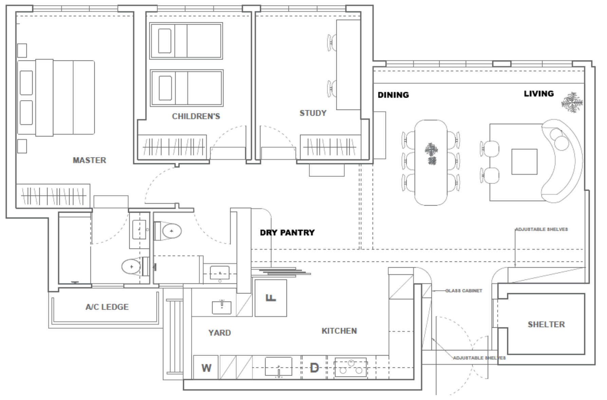

Eventually, I decided on the following networking plan:

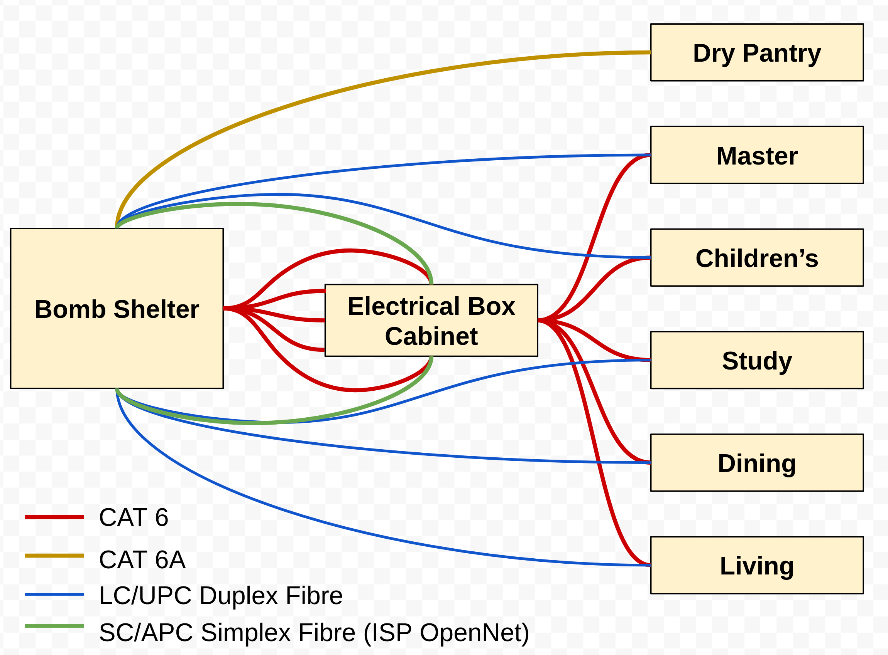

If anyone is wondering what the bomb shelter is, it is a requirement by the government to provide air raid shelters within all public housing constructed since 1997. I presume any Swiss readers won't be too surprised by this setup. Alas, the truth is, the vast majority of HDB flat owners use it as a storeroom and would be hard pressed to house their entire family inside during an emergency. For me, I've decided to use it to house my server equipment.

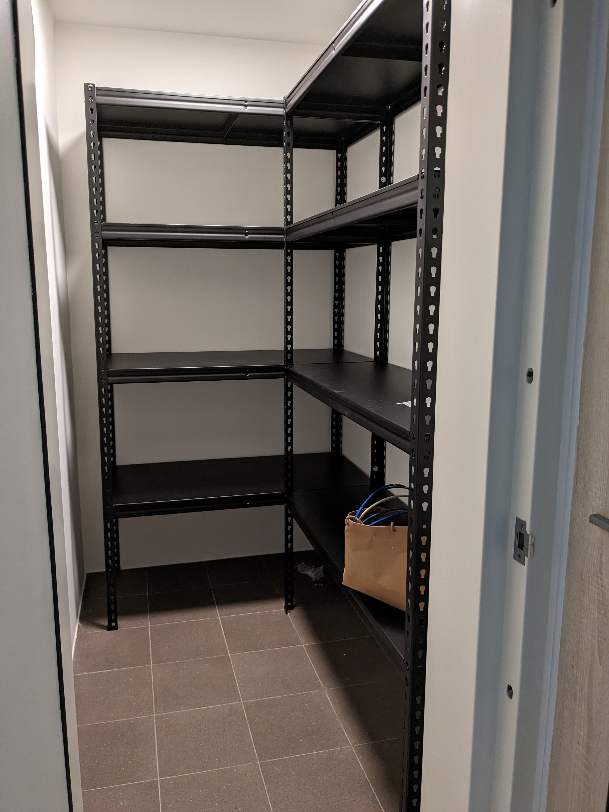

The general implementation idea was to pull both of the Fibre-to-the-Home (FTTH) ports and Ethernet connections into the bomb shelter where I would have more space to properly wire up my gateway server. I figured that centralising all the existing connections to the bomb shelter would allow me to lay my fibre cables directly from there to the rest of the home for easier network switching. As you can see below, there really isn't much space to work with within the tiny cabinet.

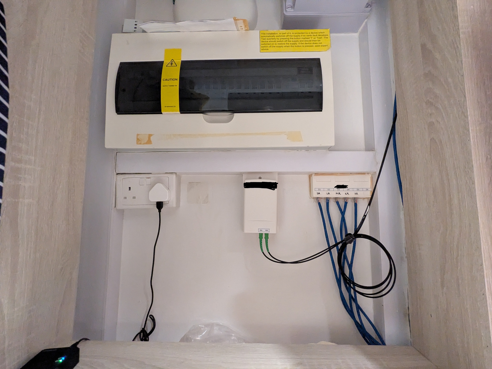

The bomb shelter came installed with 2 round air vents, which made it convenient for me to pull networking cables into the shelter to use it as my network gateway room. The original plan was to install ventilation fans on both vents to circulate the air within the shelter in order to deal with the equipment heat. But the installers advised that due to my renovation design, the false ceilings that would help with concealing the cabling would also make air exchange ineffective. As such, the bomb shelter would be passively vented. By that, I meant allowing normal convection currents to take over -- as the air around my gateway device heats up, it rises and exits from the vent. In hindsight, this has worked out extremely well, with the servers running under 70 degrees Celsius even on hot sunny days.

With the plans in place and decisions made, the next challenge was to teach the contracted electricians how to do optic fibre networking. They knew what Ethernet cables are, and understood that FTTH is that little white box inside the DB Box cabinet with 2 green sockets. They also spoke very little English, mostly Mandarin and Cantonese. This is a huge problem as I needed them to be able to open up my FS.com deliveries and independently lay the correct cables and test out the connections without snapping the fragile fibre glass. Unfortunately, my full-time job was still in Zurich so it would be a fully hands off remote renovation management project. Based on my limited knowledge at that time, it was like the blind leading the blind.

# Becoming a Fibrous Sensei

The solution? I spent night and day learning about fibre networking knowledge before translating everything into Mandarin. After all, one can't properly teach another person without actually understanding what is being taught, let alone translate into something comprehensible. It took a while because OpenNet (now NetLink Trust), the company that installed the FTTH ports, couldn't give me a straight answer as to what connector and fibre is being used. Fortunately, my parents had an existing fibre internet plan, so I headed over to their place and took a look at the fibre cables being used. They were SC/APC OS2 SMF.

> Note that while the convention is to use green connectors for APC and blue for UPC, these connectors can be customised into any colours and combinations. It is best that you actually take a look at the physical connector size and shape.

Here're some examples of what the electrician manual looked like ([Link to actual PDF](instructions.pdf)):

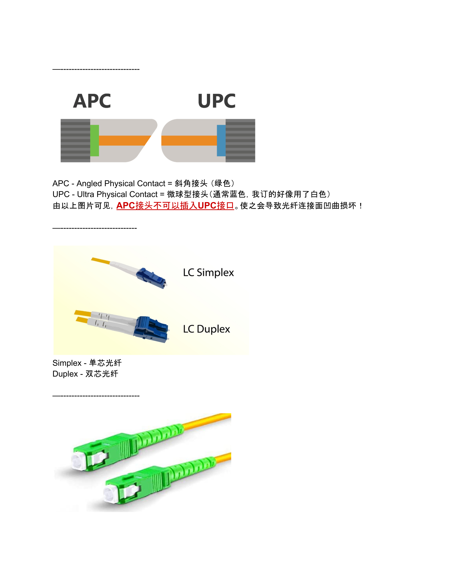

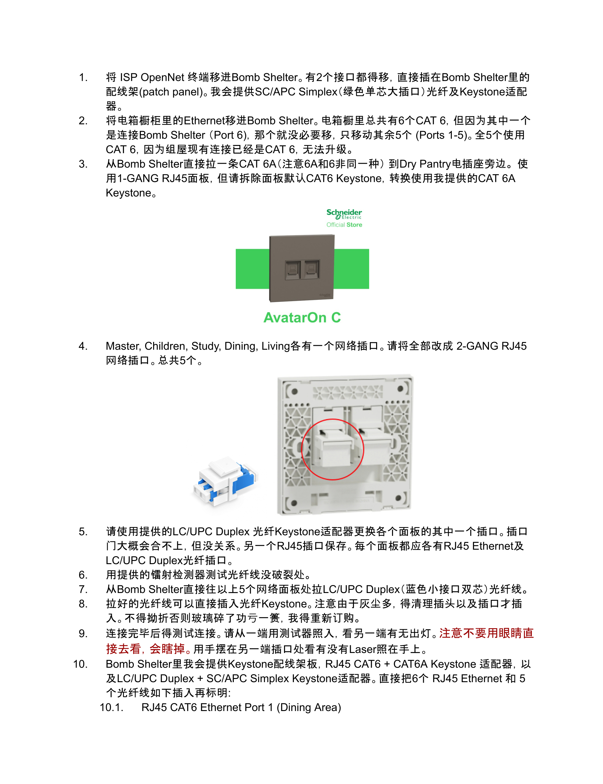

In order to provide full flexibility, I made sure that all patch panels and wall sockets used keystone adapters. This is something that worked out incredibly well post-renovation.

And so, the remote renovations started. I originally asked for a flat wide cable duct to be buried under the flooring concrete, but was told by my electricians that it would introduce sharp angles that may snap the fibre cables when they are pulling it through. Instead, circular PVC ducts were used, with the eventual surrounding cement screed providing structural support. One of the elctricians also asked me to look into black fibre cables that the ISPs used for burying fibre underground because the yellow ones looked extremely fragile. The account manager from FS.com told me that they did indeed carry these black ***"mIlItArY gRaDe"*** (rebranded to [Industrial Armored](https://www.fs.com/sg/c/industrial-cables-1148) since) fibre cables that could withstand bulldozers.

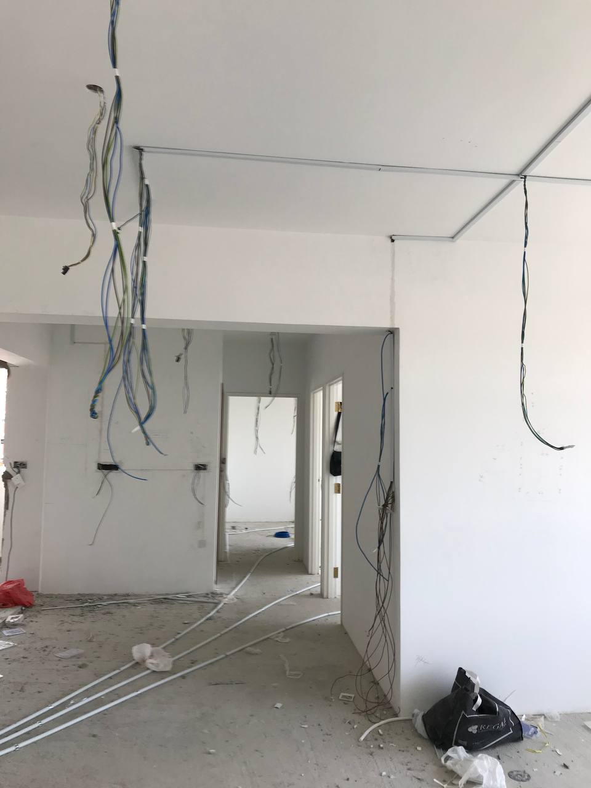

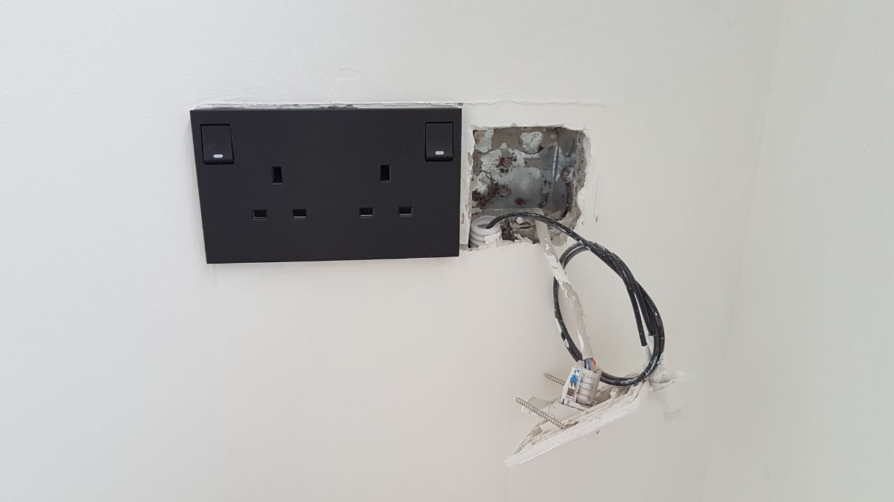

I also had the electricians rip out the existing doorbell and pulled CAT 6 cable to where it was; I didn't know what doorbell I'd be getting, but I knew it'd have to be PoE.

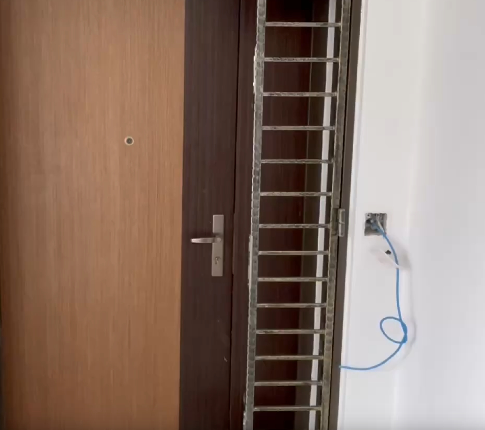

# Completion

The cabling and cement screeding works were completed within the first few weeks of the renovation, but the entire renovation process only really ended at the start of 2023. The process took about 10 months, 4 months longer than needed, due to a tiling subcontractor ghosting both me and my interior designer / general contractor. Overall, my family was pretty happy with the results, given that we had managed the entire project remotely.

Here is a brief look at the outcome:

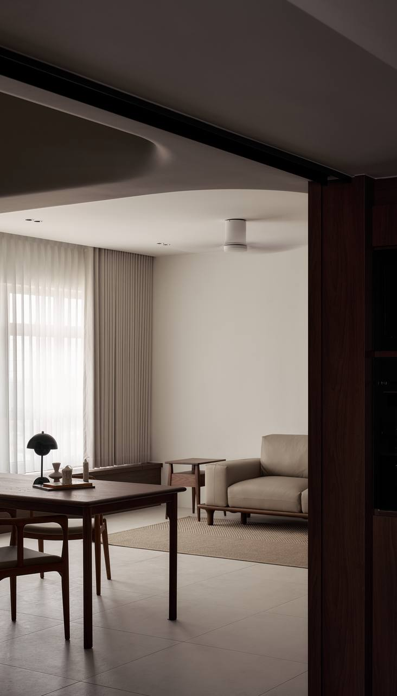

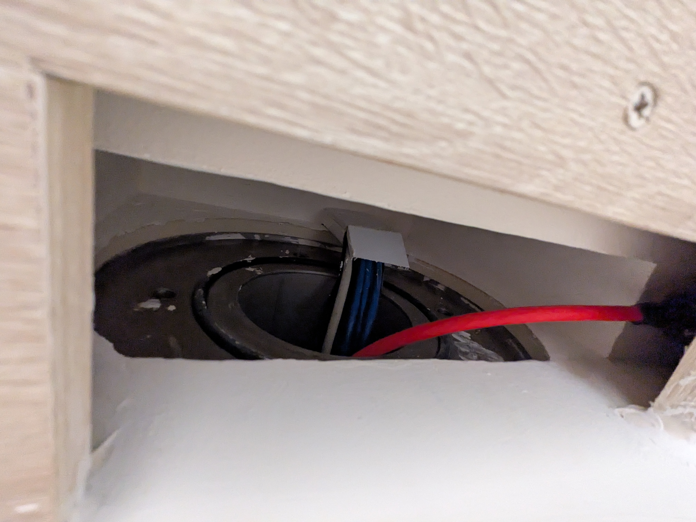

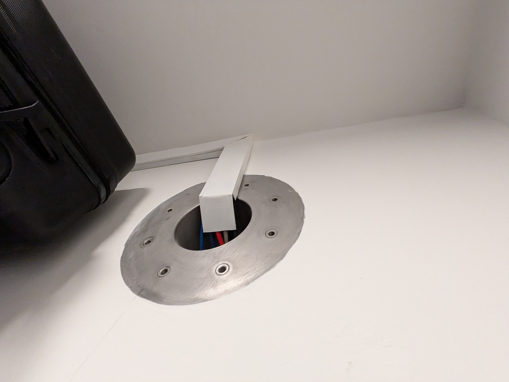

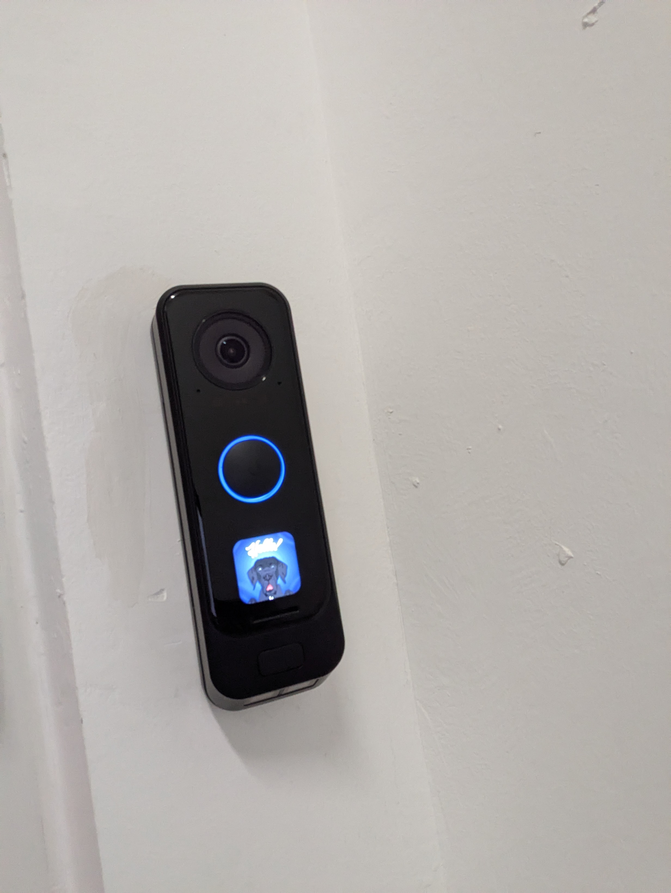

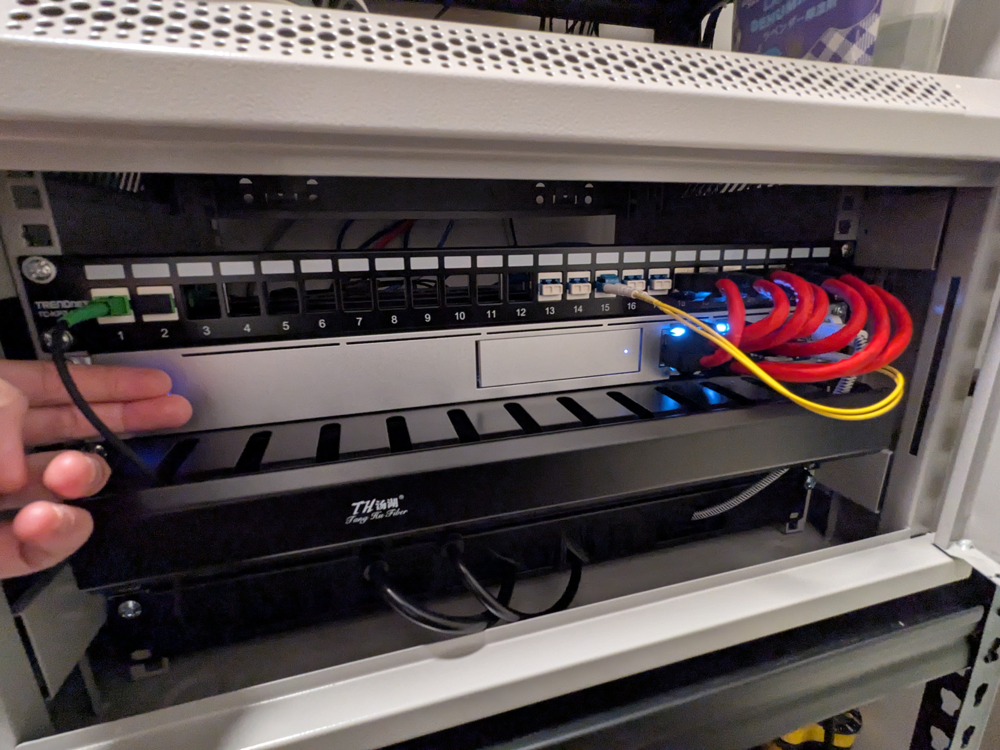

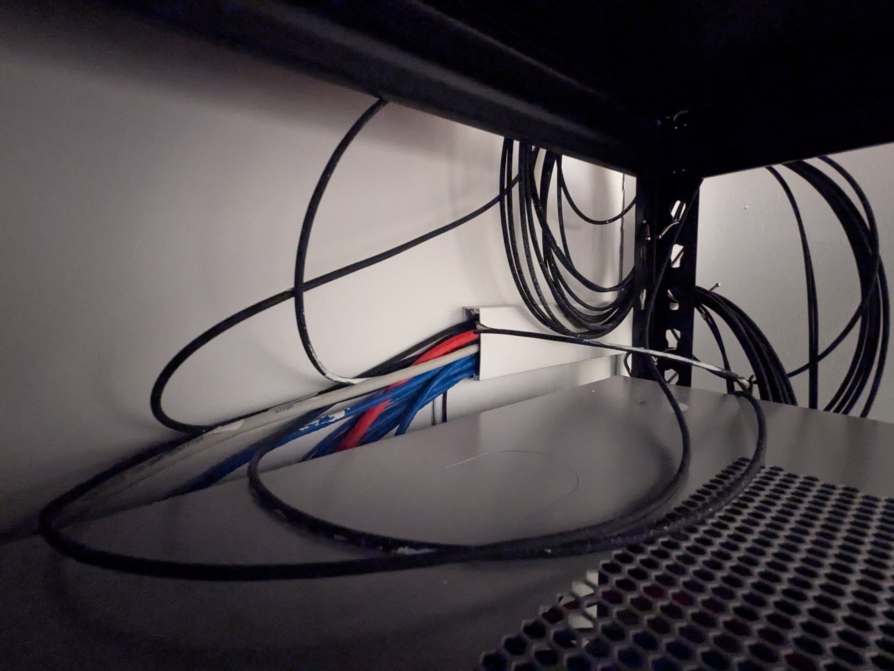

The cable management still leaves much to be desired. The laundry hooks would have to suffice for now while I find inspiration on how to clean up the cables.

While deciding on a gateway device, I sought the advice from fellow Googlers on `g/homelab` and got a few options:

* pfSense / OPNsense. These were supposedly very easy to set up and configure.
* Ubiquiti. Plug and play, super easy to set up.
* Erik, my fellow YouTube SRE, suggested using an old PC and running Linux on it. No need for all the fancy stuff, just use a Linux machine as a gateway machine.

Ultimately, someone asked if anyone in my household was able to properly restart a Linux or pfSense machine if I were to be incapacitated. That question quickly led to my decision on choosing Ubiquiti. I believe this was the only option that my wife would be comfortable with cycling the power. The whole Unifi ecosystem also made it very easy for me to set up home cameras with their all-in-one integration. I was also a huge fan of their self-hosted doorbells, because I had absolutely zero faith in cloud-based IoT devices maintaining support throughout the lifetime of my residence.

So that about wraps up part 1 of my homelab building project. The fibre network infrastructure has been lying dormant under my feet for the past 2 years, and I've finally started to build up a proper separately hosted, fibre connected, machine cluster.

More to be covered in the next parts, but just a slight preview of my TaoBao acquired `MS-A2-9955 96GB+2TB`.

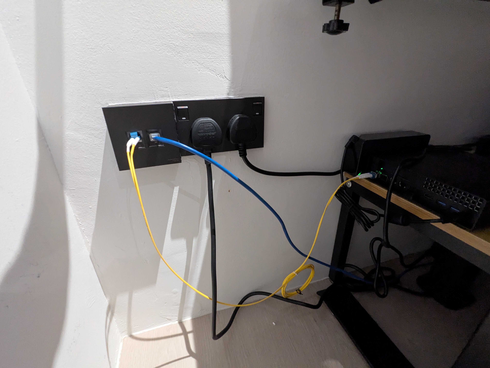
