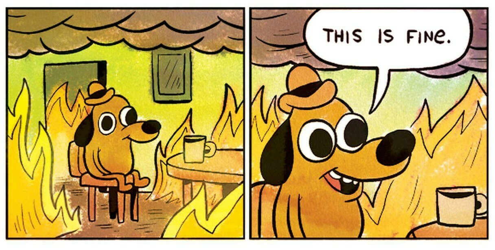

+++
date = '2024-11-01'
draft = false
title = 'Debugging SRE #2: Pager Burnout'
categories = ['Debugging SRE']
tags = [
    'burnout',
    'on-call',
    'pager',
    'sre',
    'toil',
]
+++

It goes without saying that even the most disciplined SRE functions eventually
experience pager burnout. Over time, I've found that the reasons can be
condensed down to 4 main reasons:

* Lack of pager review
* Undersized teams
* Incompatible on-call shift length
* Inadequate on-call compensation

## Pager Review

### Treat a Page Like a Page

The most mindblowing thing to me was seeing teams use Slack notifications as a
pager alert.

Repeat after me:

> **A Slack message is NOT a page.**

Feeding all alerts into a Slack channel, or even multiple Slack channels, will
conflate all urgency levels for alerts. And because a Slack notification just
beeps on the phone, on-callers end up glued to their phone 24/7, never able to
detach from work even after business hours.

There is a better way to do this. All alerts should be broadly categorised into:

* Page (Urgent)
  * Send an alert requiring immediate attention and acknowledgement. This can be
    an SMS, a phone call, or an app like PagerDuty that sends a push
    notification which overrides on your phone alarm settings.
* Notify (Not Urgent)
  * Send a Slack notification, file a Jira ticket, send an email.

Just by doing this, teams can chuck non-urgent signals into a queue to work on
during office hours. On-call responders can tune out from the Slack channels to
only respond when paged.

### Tweak Alert Thresholds

One of the first things I noticed after joining my current team was the sheer
amount of alert noise going on in the Slack channels. A major part of the noise
were clearly due to overly sensitive alerting thresholds and low priority
signals:

1. 1 pod in a service had a 2 minute CPU utilisation above 50%.
2. Increased 4XX errors not within rollout periods.
3. Batch job taking longer than usual to run.
4. P99 latency above 500ms for 1 minute.

Are these signals important? It depends on the context, but the easiest way to
ascertain is to ask the question: "What's the worst that can happen if this
issue is handled next business day?"

Every team should set up fixed intervals for pager hygiene check-ins. Get every
on-call responder together, list and group all pager alerts, then review with
the following chart:

## Size Your Team Correctly

When asked what the correct size of a SRE team (or on-call response roster)
should be, I usually say 6 is minimum, 8 is a comfortable N+2. Coincidentally,
the number 8 is also recommended by the
[Google SRE Book](https://sre.google/sre-book/service-best-practices/).

While the book failed to provide any data based rationale for the recommended
number, I could try to fill in the reasoning here based on my own anecdotal
experience (I know, it's a sample size of 1 so pinch of salt).

There are a few considerations when staffing an on-call roster:

1. Scope of work - Is it purely on-call response and operations? Or is it
   on-call + ops + project work?
2. Fatigue management - How many pages does the average on-caller get per shift?
   How long ago was the previous shift?
3. Familiarity - Are the shifts close enough to retain response familiarity? Are
   the shifts far enough that responders get to rest their mind and get project
   work done?
4. Length of shifts - Are the shifts long enough to retain context for alert
   response? Are the shifts short enough that the responder doesn't dread each
   shift?

Personally, I have found that after a week-long shift, I would take about 5-6
weeks to recover enough to psyche myself up for the next shift. This translates
to a minimum requirement of 6 people on the on-call roster. In order to ensure
that the service would run smoothly even during the festive season where
multiple people would be going on vacation, we provision N+2 for 8 people on
rotation.

This number may be able to be reduced if the responders are full-time on-call
responders and operations. But given that most small to medium tech companies
expect their development team to do on-call, the recommendation of 8 people
would definitely apply.

---

### Anecdote Time

> I joined YouTube Video Processing SRE in 2021 and found out that a large chunk
> of the Zürich team had just transferred out. The on-call rotation, inclusive
> of me, had dropped to just 5 people. Hiring became my manager's top priority,
> while also asking for volunteers from other SRE teams to double hat on our
> roster. Any time one of us had to go on a long vacation, I would dread the
> on-call shifts as I could get almost nothing done for my projects. The entire
> team had to do our own bin packing of on-call shifts as we were all maxing out
> the quarterly cap of 80h on-call. After which we no longer get paid for it.
> Things only mellowed out after we hired 2 more SREs onto the team.

---

When I first brought up this number, the immediate reaction by several managers
was that an 8-person team was too big and bloated. They seem to conflate project
work and running operations. Because regardless of workload, you need to provide
enough space between shifts for a reliable on-call roster. Furthermore, unlike
YouTube where I had 12h shifts before handing off to the San Bruno team, my
current vocation is in a single region service. The shifts are 24/7, there is no
mental rest for an entire week.

Too many people discount the mental abuse one goes through having to go to bed
every night knowing that there is a chance they'd be woken up at 3am. Weekends
involve staying at home most of the time because lugging a laptop around is such
a chore. Hiking is a production readiness hazard, since you might lose reception
on your phone and miss a page.

There is no mental sanctuary for the entirety of the on-call period. There is
no escape for the unrelated spouse who gets woken up in a panic, slapping the
shit out of the on-caller about the system burning down. My wife still shudders
to this day when a specific Android ringtone starts playing.

Do the right thing, min 6 best 8.

## Play Around with Shift Lengths

Here's a list of on-call intervals that my various teams have tried and tested,
along with what I think of it:

* 2 weeks
  * Pure torture. No escape for 2 whole weeks. 2 whole weekends burnt. Zero
  project work done.
* 1 week
  * It's the default. It's manageable, but I was always looking forward to the
  end of the suffering.
* 1 day
  * It's nice that I can hand off and not think about on-call for a week, but I
  lose contiguous project work weeks. The shift is also not long enough for me
  to do any meaningful follow-ups on the system tickets before handing off to
  the next on-caller. The system tickets just start to pile up.
* Half week (M-T, F-S)
  * Optimum. I either get M-T shifts where I lose the majority of the week or I
  lose the entire TGIF and weekend. Either way I still get something out of the
  week.

## Respect Your On-Callers' Time With Compensation

Google SWEs don't get paid for on-call under most circumstances. However, Google
SREs are paid 67% (tier 1) of their hourly rate for on-call duty outside
business hours. This compensation is paid out regardless of whether the
responder is paged. This means that if a Google SRE has a weekend on-call shift,
they are paid like a full working day. These can either be cashed out or
converted to Off-In-Lieu.

Meta on the other hand adopts the method of paying their platform engineers
higher on base, but nothing for the on-call shifts.

Most of the other tech companies that I have asked do none of the above. Instead
they typically choose 1 of the 3:

* No on-call compensation (OCC). Do your damn job.
* 1:1 Off-in-lieu only if paged, and only if response time stretches over a
threshold.
* Manager issues off-in-lieu sparingly based on gut feeling. Maximum X number of
days a year.

Here's why I think Google's approach makes the most sense.

* Google - On-caller gets paid either way. It is in their best interest to
reduce noisy pages and resolve the alert as soon as possible. On-call shifts
mean extra pay or time off. So on-callers dread their shifts less.
* Meta - Engineers get paid the same higher base regardless of whether they are
on an on-call roster, so why would anyone be happy to go on-call?
* No OCC at all - Competent engineers will just leave, or reject on-call shifts
over time, since their personal time isn't respected.
* 1:1 OIL for threshold - On-callers will just stretch out the response time to
hit the threshold.
* Manager gut feel - This is much like no OCC at all.

On-call rosters with no OCC generally suffer high attrition rates, leading to
brain drain and lowered MTTR. The responders usually quit or move to teams with
no on-call. Do you have a team that seems to be running smoothly with no OCC at
all? Let's check back in after 12 months and see how's that going.

Respect the personal time of people who are willing to take the mental torture
to upkeep the reliability of your services.
